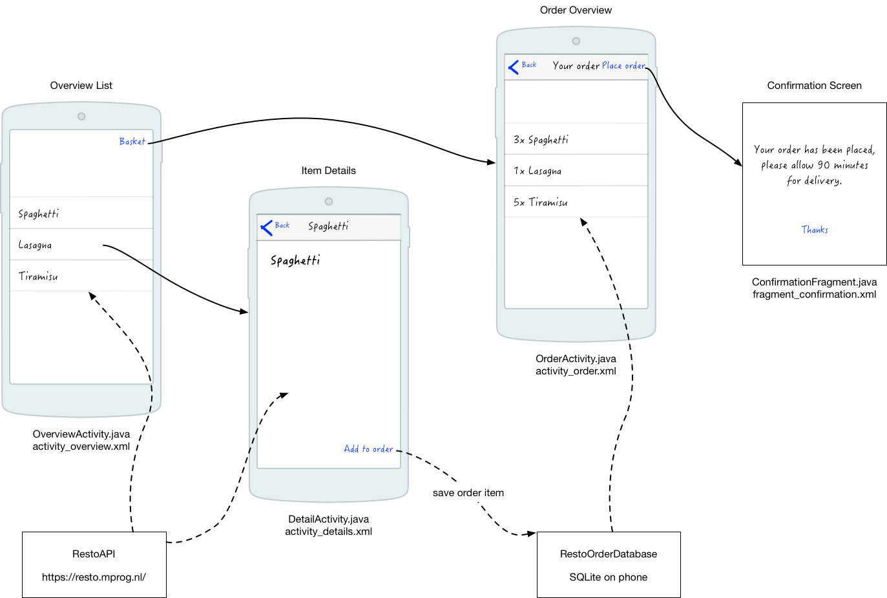

# Design Document

Based on your proposal, you can now start studying your problem in a more
technical fashion. The teaching staff and your fellow students can help you
spot fundamental problems that need to be solved, or if
technical limitations will likely prevent you from finishing the
project.

## An overview of your application

Map the separate parts of the solution onto the framework(s) that you are
using. What APIs, methods or techniques do you need to implement each feature?
Think about and fully express how the user interface will be handled, where the
data is coming from, and how the various parts will work together to form a
complete application.

> It is expected that you separate, in your code, handling of the user interface from data management and from complex algorithms whenever possible.

Some parts that you may describe here:

- advanced sketches of your UI that clearly explain which features are
  connected to which underlying part of the code

    

- a diagram of utility modules, classes and functions that you will need to implement, in
  appropriate detail

    

- a list of APIs and frameworks or plugins that you will be using to provide
  functionality in your app

- a list of data sources if you will get data from an external source, including information on how your are going to filter and transform the data for your project

- a list of database tables and fields (and their types) if you will use a database

If your application has multiple independent programs working together (e.g. a
separate script to clean your dataset) you need to provide a high-level
overview of these components and then provide a lower-level overview of the
inner workings of each component.

## Repository

Save your design document as **DESIGN.md** in the root of your GitHub
repository. Don't forget to update your **README.md** if you have made any
incompatible decisions, and push that file, too!
