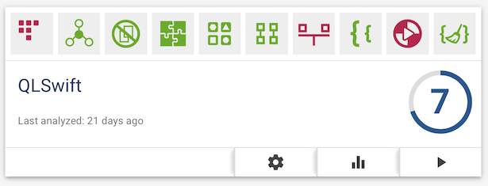
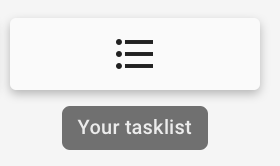

## Delivering a Better Code Hub report of the beta version (deadline: Friday)

During the last week you will work on improving the quality of your code. To guide you with this task, you use [Better Code Hub](https://www.bettercodehub.com). This website analyzes your repository along 10 guidelines for maintainability:

- Write Short Units of Code
- Write Simple Units of Code
- Write Code Once
- Keep Unit Interfaces Small
- Seperate Concerns in Modules
- Couple Architecture Components Loosely
- Keep Architecture Components Balanced
- Keep Your Codebase Small
- Automate Tests (not in the scope of this course)
- Write Clean Code

Within Better Code Hub you can read up on these guidelines. If you want more in depth information, take a look at the "Building Maintainable Software" book written by Joost Visser. You can find this book on the shelf in A1.16.

### Rank

### Tasklist

Create a tasklist of problem areas in your code. This helps you to focus on fixing these problem areas. 

You can use the tasklist tool within Better Code Hub:

Now it is your job to interpreted this tasklist and make descisions on how to improve your code. You can use the before mentioned book to help you better understand the guidelines. 

### Deliver

You must document your audit of the code quality. Save a report as **BCH.md** in the root of your GitHub repository. This must contain:

- A screenshot of the rank as shown above (including the 10 icons)
- A summary of the tasklist you created and prioritize by ordering the tasks. (Define the order)

Also add the Better Code Hub status badge to the top of your README.MD. This looks like:

You can find the Markdown code under settings:

### Help

Feel free to contact Julian at [j.jansen@sig.eu](mailto:j.jansen@sig.eu) for problems, questions and/or suggestions. 